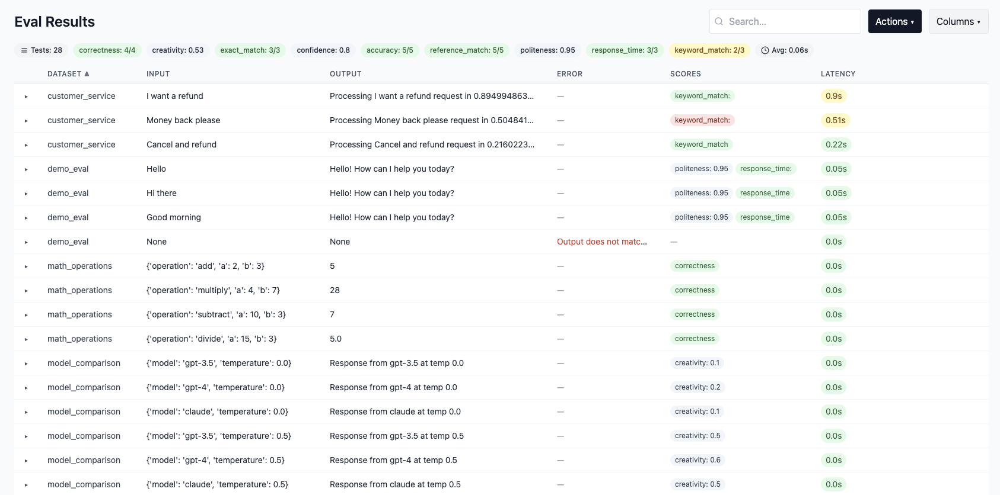

# Twevals

Lightweight evals for AI agents and LLM apps. Write Python functions, use `EvalContext` to track results, and Twevals handles storage, scoring, and a small web UI.

## Installation

Twevals is intended as a development dependency.

```bash
pip install twevals
# or with uv
uv add --dev twevals
```

## Quick start

Look at the [examples](examples/) directory for runnable snippets.
Run the demo suite and open the UI:

```bash
twevals serve examples
```



### UI highlights

- Expand rows to see inputs, outputs, metadata, scores, and annotations.
- Edit datasets, labels, scores, metadata, or annotations inline; changes persist to JSON.
- Actions menu: refresh, rerun the suite, export JSON/CSV.

Common `serve` flags: `--dataset`, `--label`, `-c/--concurrency`, `--dev`, `--host`, `--port`, `-q/--quiet`, `-v/--verbose`.

## Authoring evals

Write evals like tests. Add a `ctx: EvalContext` parameter, and Twevals auto-injects a mutable context object for building your evaluation.

```python
from twevals import eval, EvalContext

@eval(
    input="I want a refund",
    dataset="customer_service",
    default_score_key="correctness"
)
async def test_refund(ctx: EvalContext):
    # ctx.input already set from decorator
    ctx.add_output(await run_agent(ctx.input))
    ctx.add_score(ctx.output == "expected refund response", "Validation")
    # No return needed - decorator auto-returns!
```

### EvalContext

`EvalContext` is a mutable builder that makes writing evals clean and intuitive. When your function has a `ctx`, `context`, or `carrier` parameter, Twevals automatically injects an `EvalContext` instance.

**Key features:**
- **Auto-injection**: Just add `ctx: EvalContext` parameter
- **Smart methods**: `add_output()`, `add_score()`, `set_params()`
- **Auto-return**: No explicit return needed
- **IDE support**: Full type hints and autocomplete
- **Incremental building**: Set fields as you get them
- **Exception safety**: Partial data preserved on errors

**Core methods:**

```python
# Smart output extraction
ctx.add_output({"output": "result", "latency": 0.5, "run_data": {...}})
# Or simple value
ctx.add_output("simple output")

# Flexible scoring
ctx.add_score(True, "Test passed")  # Boolean with default key
ctx.add_score(0.95, "High score", key="similarity")  # Numeric with custom key
ctx.add_score(key="detailed", passed=True, value=0.98, notes="...")  # Full control

# Note: add_score() is optional! If you never call it, the test automatically
# passes with the default score key. Just like pytest - if your test runs
# through without errors, it passes.

# Helper for parametrize
ctx.set_params(model="gpt-4", temperature=0.7)  # Sets both input and metadata
```

**Direct field access:**

```python
ctx.input = "test input"
ctx.reference = "expected output"
ctx.metadata = {"model": "gpt-4"}
# ... and more: output, latency, run_data, error
```

### Writing your first eval

The cleanest pattern sets everything you can in the decorator:

```python
from twevals import eval, EvalContext

@eval(
    input="I want a refund",
    reference="I'll help you process your refund request.",
    dataset="customer_service",
    default_score_key="correctness",
    metadata={"model": "gpt-4", "version": "1.0"}
)
async def test_refund_request(ctx: EvalContext):
    # ctx.input and ctx.reference already set!
    ctx.add_output(await run_agent(ctx.input))
    ctx.add_score(ctx.output == ctx.reference, "Output validation")
```

### Common patterns

**1) Set input in function (more dynamic):**

```python
@eval(dataset="greetings", default_score_key="politeness")
async def test_greeting(ctx: EvalContext):
    ctx.input = "Hello there"
    ctx.reference = fetch_expected_greeting()

    ctx.add_output(await run_agent(ctx.input))
    ctx.add_score(ctx.output == ctx.reference, "Match check")
```

**2) Smart field extraction:**

```python
@eval(dataset="qa", default_score_key="accuracy")
async def test_question(ctx: EvalContext):
    ctx.input = "What is the capital of France?"
    ctx.reference = "Paris"

    # Extracts output, latency, run_data, metadata from dict
    ctx.add_output(await run_agent(ctx.input))

    ctx.add_score(ctx.reference.lower() in ctx.output.lower(), "Contains answer")
```

**3) Multiple scores:**

```python
@eval(dataset="qa", default_score_key="exact_match")
async def test_multi_score(ctx: EvalContext):
    ctx.input = "What is 2+2?"
    ctx.reference = "4"
    ctx.add_output(await run_agent(ctx.input))

    # Boolean score with default key
    ctx.add_score(ctx.reference in ctx.output, "Exact match")

    # Numeric score with custom key
    similarity = calculate_similarity(ctx.output, ctx.reference)
    ctx.add_score(similarity, "Similarity score", key="similarity")

    # Full control
    ctx.add_score(
        key="confidence",
        value=0.95,
        passed=True,
        notes="High confidence prediction"
    )
```

**4) Explicit return (optional):**

```python
@eval(dataset="test")
async def test_explicit(ctx: EvalContext):
    ctx.input = "test"
    ctx.add_output("output")
    ctx.add_score(True, "Passed", key="test")
    return ctx  # Optional - decorator auto-converts to EvalResult
```

### `@eval` decorator

Wraps a function and records evaluation results.

**Parameters:**
- `dataset` (str, optional): Groups related evals (defaults to filename)
- `labels` (list, optional): Filtering tags
- `evaluators` (list, optional): Callables that add scores to a result
- `target` (callable, optional): Pre-hook that runs before the eval, populating the `EvalContext`
- `input` (any, optional): Pre-populate ctx.input
- `reference` (any, optional): Pre-populate ctx.reference
- `default_score_key` (str, optional): Default key for `add_score()`
- `metadata` (dict, optional): Pre-populate ctx.metadata
- `metadata_from_params` (list, optional): Auto-extract params to metadata

**Examples:**

```python
# Minimal
@eval()
def test(ctx: EvalContext):
    ...

# With defaults
@eval(
    dataset="my_tests",
    default_score_key="correctness",
    metadata={"version": "1.0"}
)
def test(ctx: EvalContext):
    ...

# Pre-populated input/reference
@eval(
    input="test input",
    reference="expected",
    dataset="static_tests"
)
def test(ctx: EvalContext):
    # ctx.input and ctx.reference already set!
    ...

# Target hook to run your agent and inject results
def call_agent(ctx: EvalContext):
    # Use any attributes you like on the context
    ctx.trace_id = "abc123"
    ctx.add_output(my_agent(ctx.input), metadata={"trace_id": ctx.trace_id})

@eval(
    target=call_agent,
    input="What is the weather?",
    dataset="agent_calls",
)
def test_with_target(ctx: EvalContext):
    # ctx.output comes from the target hook, ctx.trace_id is preserved
    ctx.add_score("weather" in ctx.output.lower(), notes="Contains answer")
    return ctx.build()
```
If your target returns a value, it is treated as `ctx.output` by default (dicts are passed to `ctx.add_output()`).

### `@parametrize`

Generate multiple evals from one function. Place `@eval` above `@parametrize`.

**Auto-mapping magic:**

When parameter names match EvalContext fields (`input`, `reference`, `metadata`, etc.), they automatically populate the context:

```python
from twevals import parametrize

@eval(dataset="sentiment", default_score_key="accuracy")
@parametrize("input,reference", [
    ("I love this!", "positive"),
    ("This is terrible", "negative"),
    ("It's okay I guess", "neutral"),
])
def test_sentiment(ctx: EvalContext):
    # ctx.input and ctx.reference auto-populated! ✨

    detected = analyze_sentiment(ctx.input)
    ctx.add_output(detected)
    ctx.add_score(ctx.output == ctx.reference, f"Detected: {detected}")

# Parametrize + targets: param sets are available to the target via ctx.input/ctx.metadata
def call_agent(ctx: EvalContext):
    ctx.add_output(my_agent(ctx.input["prompt"]))

@eval(target=call_agent)
@parametrize("prompt", ["hello", "world"])
def test_prompt(ctx: EvalContext):
    assert "prompt" in ctx.input  # set before target runs
    return ctx.build()
```

**Custom parameters:**

```python
@eval(dataset="math", default_score_key="correctness")
@parametrize("operation,a,b,expected", [
    ("add", 2, 3, 5),
    ("multiply", 4, 7, 28),
])
def test_calculator(ctx: EvalContext, operation, a, b, expected):
    ctx.input = {"operation": operation, "a": a, "b": b}
    ctx.reference = expected

    ops = {"add": lambda x, y: x + y, "multiply": lambda x, y: x * y}
    result = ops[operation](a, b)

    ctx.add_output(result)
    ctx.add_score(result == expected, f"{a} {operation} {b} = {result}")
```

**Common patterns:**

```python
# 1) Single parameter with IDs
@eval(dataset="thresholds")
@parametrize("threshold", [0.2, 0.5, 0.8], ids=["low", "mid", "high"])
def test_threshold(ctx: EvalContext, threshold):
    ctx.input = threshold
    ctx.add_output(evaluate(threshold))
    ctx.add_score(ctx.output > threshold, "Above threshold")

# 2) Cartesian product (stacked parametrize)
@eval(dataset="models", default_score_key="quality")
@parametrize("model", ["gpt-4", "gpt-3.5"])
@parametrize("temperature", [0.0, 0.7, 1.0])
def test_model_grid(ctx: EvalContext, model, temperature):
    ctx.set_params(model=model, temperature=temperature)  # Sets input and metadata
    ctx.add_output(run_model(model, temperature))
    ctx.add_score(score_output(ctx.output), f"Model: {model}")

# 3) Dictionaries for named arguments
@eval(dataset="auth")
@parametrize("username,password,should_succeed", [
    {"username": "alice", "password": "correct", "should_succeed": True},
    {"username": "alice", "password": "wrong", "should_succeed": False},
])
def test_login(ctx: EvalContext, username, password, should_succeed):
    ctx.input = {"username": username}
    result = login(username, password)
    ctx.add_output(result)
    ctx.add_score(result.success == should_succeed, "Login check", key="auth")
```

**Notes:**
- Accepts tuples, dicts, or single values
- Works with sync or async functions
- Put `@eval` above `@parametrize`
- Parameter names matching `input`, `reference`, etc. auto-populate context

See more patterns in `examples/new_demo.py`.

## Advanced patterns

### Assertion preservation

Assertions are treated as validation failures and create failing scores:

```python
@eval(dataset="validation", default_score_key="correctness")
async def test_with_assertion(ctx: EvalContext):
    ctx.input = "test"
    ctx.reference = "expected"
    ctx.metadata = {"model": "gpt-4"}

    ctx.add_output(await run_agent(ctx.input))

    # If this fails, a failing score is added with the assertion message
    # All data (input/output/reference/metadata) is preserved
    assert ctx.output == ctx.reference, "Output mismatch"

    ctx.add_score(True, "All checks passed")
```

### Context manager pattern

For explicit control:

```python
@eval(dataset="test")
async def test_with_context_manager():
    with EvalContext(input="test", default_score_key="accuracy") as ctx:
        ctx.add_output(await run_agent(ctx.input))
        ctx.add_score(True, "Passed")
        return ctx  # Explicit return
```

### Ultra-minimal pattern

The absolute shortest eval (2 lines!):

```python
@eval(dataset="sentiment", default_score_key="accuracy")
@parametrize("input,reference", [("I love this!", "positive"), ("Terrible!", "negative")])
def test(ctx: EvalContext):
    ctx.add_output(analyze(ctx.input))
    ctx.add_score(ctx.output == ctx.reference)
```

## Reference

### EvalResult schema

`EvalContext` automatically builds an `EvalResult` object when the evaluation completes. You can also return `EvalResult` directly if you prefer:

```python
from twevals import EvalResult

@eval(dataset="test")
def test_direct():
    return EvalResult(
        input="...",          # required: test input
        output="...",         # required: system output
        reference="...",      # optional: expected output
        error=None,           # optional: error message
        latency=0.123,        # optional: execution time (auto-calculated if not provided)
        metadata={"model": "gpt-4"},  # optional: metadata for filtering
        run_data={"trace": [...]},     # optional: debug data
        scores={"key": "exact", "passed": True},  # scores dict or list
    )
```

### Score schema

```python
{
    "key": "metric_name",    # required: Name of the metric
    "value": 0.95,           # optional: Numeric score
    "passed": True,          # optional: Boolean pass/fail
    "notes": "...",          # optional: Justification
}
# Must provide at least one of: value or passed
```

`scores` accepts a single dict, a list of dicts, or a list of `Score` objects.

### Evaluators

Callables that add scores to results after execution:

```python
def custom_evaluator(result):
    """Returns Score object, dict, or list of either"""
    if result.reference in result.output.lower():
        return {"key": "contains_ref", "passed": True}
    return {"key": "contains_ref", "passed": False}

@eval(dataset="test", evaluators=[custom_evaluator])
def test_with_evaluator(ctx: EvalContext):
    ctx.input = "test"
    ctx.add_output("test output")
    # custom_evaluator runs after, adds score
```

## Headless runs

Skip the UI and save results to disk:

```bash
twevals run path/to/evals
# Run specific function: twevals run path/to/evals.py::function_name
# Run parametrized variant: twevals run path/to/evals.py::function_name[param_id]
# Filtering and other common flags work here as well
```

`run`-only flags: `-o/--output` (save JSON summary), `--csv` (save CSV), `--json` (output compact JSON to stdout).

## CLI reference

```
twevals serve <path>   # run evals once and launch the web UI
twevals run <path>     # run without UI
twevals run <path>::<function>  # run specific function (e.g., tests.py::my_eval)

Common flags:
  -d, --dataset TEXT      Filter by dataset(s)
  -l, --label TEXT        Filter by label(s)
  -c, --concurrency INT   Number of concurrent evals (0 = sequential)
  -q, --quiet             Reduce logs
  -v, --verbose           Verbose logs

serve-only:
  --dev                   Enable hot reload
  --host TEXT             Host interface (default 127.0.0.1)
  --port INT              Port (default 8000)

run-only:
  -o, --output FILE       Save JSON summary
  --csv FILE              Save CSV results
  --json                  Output compact JSON to stdout (machine-readable)
```

## Contributing

```bash
uv sync
uv run pytest -q
uv run ruff check twevals tests
uv run black .
```

Helpful demo:

```bash
uv run twevals serve examples
```
