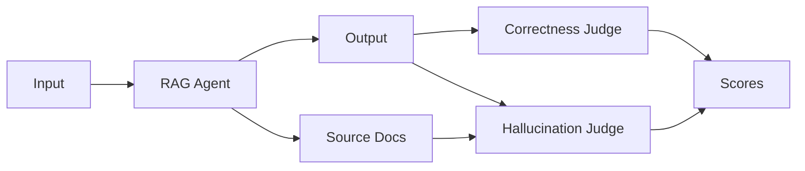

# RAG Agent Evaluation

This example shows a common pattern: evaluating a RAG agent across a dataset of question-answer pairs, checking for both hallucination and correctness.

## The Setup

You have a RAG agent that:
1. Takes a user question
2. Retrieves relevant documents
3. Generates an answer grounded in those documents

You want to evaluate:
- **Hallucination** — Is the answer grounded in the retrieved documents?
- **Correctness** — Does the answer match the expected reference?



## The Eval

```python
from twevals import eval, parametrize, EvalContext

async def run_agent(ctx: EvalContext):
    results = await run_rag_agent(ctx.input)  # Run the agent

    # Store the source docs in the context to be used in evaluation
    # Can use arbitrary property names
    ctx.my_source_docs = results.metadata["source_docs"]

    # Store the agent's response in ctx.output automatically
    return results.response


@eval(dataset="rag_qa", target=run_agent)
@parametrize("input,reference", [
    ("What is our refund policy?", "30-day money-back guarantee"),
    ("How do I reset my password?", "Click 'Forgot Password' on the login page"),
    ("What payment methods do you accept?", "Visa, Mastercard, and PayPal"),
    ("How long does shipping take?", "3-5 business days for standard shipping"),
    ("Can I change my order after placing it?", "Within 1 hour of placing the order"),
    # ... hundreds more rows
])
async def test_rag_agent(ctx: EvalContext):
    """Evaluate a RAG Agent for correctness and hallucinations"""
    # Check for hallucination using an LLM judge

    # Use an LLM-as-a-Judge to score the output for hallucination and provide it's reasoning
    score, reasoning = await hallucination_judge( 
        answer=ctx.output,
        sources=ctx.my_source_docs
    )

    # Store hallucination score separately from default "correctness" score
    ctx.add_score(
        "hallucination",
        passed=score,  # Assumes bool pass/fail here but could be replaced with `score=0.5` for example
        note=reasoning
    )

    # Check correctness against the reference with another judge
    correctness_result = await correctness_judge(
        answer=ctx.output,
        reference=ctx.reference
    )

    # Assert to use default key
    assert correctness_result.is_correct, correctness_result.explanation
```

## What's Happening

**Parametrized dataset** — The `@parametrize` decorator creates one eval run per row. Each row sets `ctx.input` and `ctx.reference` automatically.

**Target function inline** — We call `run_rag_agent()` directly in the eval function. No separate `@target` decorator needed (though you could use one if you prefer).

**Storing context for analysis** — We save the retrieved documents to `ctx.metadata`. This shows up in the results JSON and Web UI, so you can debug retrieval issues.

**Multiple scoring criteria** — We use `ctx.add_score()` for hallucination (a named score) and `assert` for correctness (the default score). Both appear in your results.

**LLM-as-judge** — The `hallucination_judge` and `correctness_judge` are placeholder functions representing whatever LLM judge you're using (OpenAI, Anthropic, your own prompts, etc.).

## Running It

```bash
# Run just this eval
twevals evals/rag_agent.py

# Run with the web UI
twevals evals/rag_agent.py --serve

# Run verbosely to see each result
twevals evals/rag_agent.py --verbose
```

## Example Results

After running, you'll have a JSON file with structured results:

```json
{
  "dataset": "rag_qa",
  "results": [
    {
      "input": "What is our refund policy?",
      "output": "We offer a 30-day money-back guarantee on all purchases.",
      "reference": "30-day money-back guarantee",
      "metadata": {
        "retrieved_docs": ["policy.md: section 4.2..."],
        "sources": ["policy.md"]
      },
      "scores": {
        "hallucination": {
          "passed": true,
          "message": "Answer is fully grounded in retrieved documents"
        },
        "default": {
          "passed": true,
          "message": null
        }
      }
    }
  ]
}
```

Your coding agent can read this JSON, analyze patterns, identify which questions have retrieval issues, and suggest improvements—all without leaving the terminal.
